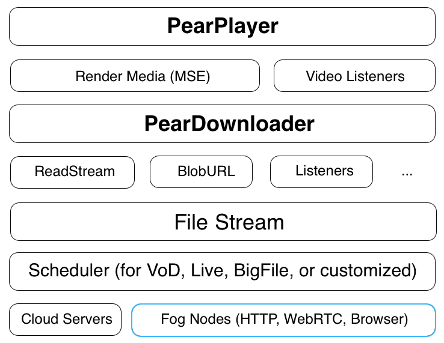

<h1 align="center">
  </img>
  <br>
  <a href="http://demo.webrtc.win/pear/downloader">PearDownloader.js</a>
  <br>
  <br>
</h1>

<h4 align="center">一个支持多协议、多源、混合P2P-CDN的下载器</h4>
<p align="center">
  <a href="https://www.npmjs.com/package/peardownloader"></a>
   <a href="https://www.jsdelivr.com/package/npm/peardownloader"></a>
 <a href="https://www.jsdelivr.com/package/npm/peardownloader"></a>
</p>
<br>

[PearPlayer.js](https://github.com/PearInc/PearPlayer.js)发布后，吸引了业界持续的关注，同时我们也收集到了许多宝贵建议。
一方面我们将持续维护更新PearPlayer，使其支持更多的拓展功能；
另一方面我们将更底层、更基础，且适用范围更广的相关组件重新整理，专注于节点的选择及数据的调度，将多源传输部分剥离出来，形成PearDownloader.js。
PearDownloader的发布，旨在降低已有成熟播放器的内容提供商(CP)的迁移成本：CP厂商可以按需将其集成到自有产品中，实现Web P2P能力；或者调度[Pear Fog](https://github.com/PearInc)的海量节点资源，享受低成本、高质量的共享雾CDN服务。
PearDownloader支持更多样化的文件类型，更灵活的调度算法、调度策略的选择，满足更广阔、灵活、多变的业务场景与业务需求。

PearDownloader（梨享下载器）**[[Demo](http://demo.webrtc.win/pear/downloader)]** 是PearPlayer的底层下载模块，
实现了融合HTTP（包含HTTPS、HTTP2）、WebRTC的多协议、多源、低延迟、高带宽利用率的无插件Web端下载加速能力。
基于高效的调度算法将来自多个节点的数据进行拼接形成完整的文件或将有序的数据/媒体流喂给上层的应用，例如音视频播放器，
PearDownloader能在保证下载速度前提下最大化P2P率。

<p align="center">
<a href="https://www.npmjs.com/package/peardownloader"></a>
</p>

只需将`pear-downloader.min.js`通过`<script>`标签导入到HTML就可以使用。
参考以下[代码示例](#使用方法)，也可以查看[`/examples/downloader-test.html`](/examples/downloader-test.html)来了解使用方法。

参考[get-started](docs/get-started.md)来了解基本使用方法。<br/>

## 特性

- P2P能力基于国际标准的WebRTC，无须安装任何客户端或插件
- 多协议(HTTP, HTTPS, WebRTC)、多源
- 多源传输能力支持目前所有已知主流浏览器（当浏览器不支持WebRTC时全调度HTTP节点）
- 通过浏览器内核的MSE，可支持音视频的边下边播
- 自研的调度算法，在保证下载速度的前提下最大化P2P率（用户亦可实现自己的调度算法，以满足不同场景需求）
- 默认无需填参数（内部根据文件属性作自适应），高级使用模式可自行调整算法和参数
- 可选接入低成本、高可用的Pear [Fog CDN](https://github.com/PearInc/FogVDN)
- 协议默认通过TLS/DTLS全加密，无DPI特征；并可通过Pear Fog组件的动态端口映射进一步消除统计学特征
- 具备Browser P2P能力（基于WebTorrent）

## 使用方法

首先通过script标签导入pear-downloader.min.js：
```html
<script src="./dist/pear-downloader.min.js"></script>
```
或者使用CDN：
```html
<script src="https://cdn.jsdelivr.net/npm/peardownloader@latest"></script>
```
假设要下载https://example.com/file.zip
```html
<script>
var downloader = new PearDownloader('https://example.com/file.zip');
</script>
```

## 如何为自己的文件加速？
示例中的文件是已经分发过的，那么如何为任意文件加速呢？很简单，只需在[文件分发系统](https://oss.webrtc.win/)中添加您的文件url，
即可利用Pear的海量节点为您的文件下载加速！具体教程请点击[这里](https://manual.webrtc.win/oss/)（文件的名字需要加上`Pear-Demo-`前缀，
如`Pear-Demo-file.zip`）

## 谁在用我们的产品？

+ [Pear Limited](https://pear.hk)
+ [Lenovo China](https://www.lenovo.com.cn/)
+ [Newifi xCloud](http://www.newifi.com/)
+ [UCloud](https://www.ucloud.cn)
+ [Tencent Cloud](https://qcloud.com)
+ [Tencent X5/TBS](https://x5.tencent.com/tbs/)
+ [Tencent APD](http://www.chinaz.com/news/2016/0707/548873.shtml)

## PearDownloader文档
- **[阅读get-started文档](docs/get-started.md)**
- **[阅读API文档](docs/api.md)**

## 致谢
特别感谢以下项目，为本项目提供了部分灵感来源以及API设计参考：

- [WebTorrent](https://github.com/webtorrent/webtorrent)
- [Peer5](https://www.peer5.com/#)

## 演讲与媒体报道

- 2017.11.24 （金色财经） - [谛听科技正式进军区块链领域，战略投资梨享计算](http://www.jinse.com/blockchain/99767.html)
- 2017.08.18 （IT大咖说） - [WebRTC会成主流吗？众包CDN时代到了！](http://mp.weixin.qq.com/s/cx_ljl2sexE0XkgliZfnmQ)
- 2017.07.11 （OSChina开源中国） - [PearPlayer.js —— 混合P2P-CDN的流媒体播放器](https://www.oschina.net/p/PearPlayerjs)
- 2017.06.24 （腾讯Web前端大会） - [基于WebRTC的P2P-CDN流媒体加速](http://www.itdks.com/dakalive/detail/2577)
- 2017.05.17 （南方科技大学） - Edge Computing and Shared Fog Streaming
- 2017.05.08 （台湾逢甲大学） - A Cooler Fruit Venture: Scaling up a Network from Cloud to Fog with Crowdsourcing
- 2016.08.17 （香港科技大学） - From Cloud to Fog: Scaling up a Network with Crowdsourcing

## License

MIT. Copyright (c) [Pear Limited](https://pear.hk) and [snowinszu](https://github.com/snowinszu).

## 帮助与支持
E-mail: <service@pear.hk>；用户QQ群：`373594967`；[CP/CDN接入、OEM与其他商务合作](https://github.com/PearInc/FogVDN)
